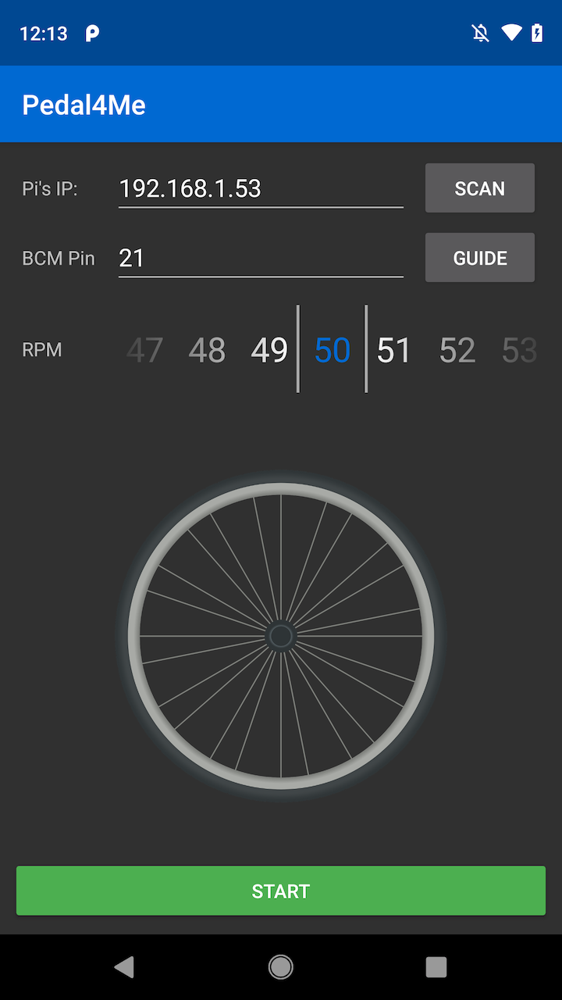

# ifit-pedaler-server

A very simple server that serves an HTML page to control simulated pedaling on a connected iFit console. Inspired by William Thomas's [https://github.com/williamt-ifit/ifitpedaler](https://github.com/williamt-ifit/ifitpedaler)

# Setup

* You will probably need to open port 80 on your raspberry pi. Simplest way to do that is via `ufw`:
```
sudo apt-get install ufw
sudo ufw allow 22 #so that you can still ssh into it
sudo ufw allow 80
sudo ufw enable
sudo reboot
```
* You will need 2 jumper wires to go from your raspberry Pi's selected BCM port + ground to the console. On a bike console, it seems like you will generally want to connect the jumper wires to the two leftmost pins (ground + pos can be in either combination, so you might have to try both).
* The best way to keep the server running at all times is to user `supervisor`. I included a `supervisord.conf` file to help you with that. The file assumes that you have cloned this repo to `/home/pi/ifit-pedaler-server` if you cloned it elsewhere, you can edit it accordingly. Copy the file to `/etc/supervisor`
* If you want to use the scanner in the Androi app, you need to enable your Pi's discovery on the local network - use Avahi for this. I included an configuration file, `ifit.service`. Copy this to `/etc/avahi/services`. 
* I included a script, `setup.sh`, that _should_ get you set up (supervisor+avahi), but I haven't tested it extensively:
```
sudo apt-get install supervisor
sudo cp supervisord.conf /etc/supervisor/supervisord.conf
sudo apt-get install avahi-daemon
sudo cp ifit.service /etc/avahi/services/ifit.service
sudo systemctl enable avahi-daemon.service
sudo supervisorctl update
```


# Usage - web app
* Run `sudo run.sh` on your pi (if you don't want to run sudo, changing your port in `run.sh` should do it)
* On your dev machine, point your browser to your Pi's local IP, e.g. `http://192.168.1.22`
* Enter in the BCM pin number that your wire is connected to
* Enter in (approximate) RPMs
* Press "Pedal!" to start pedaling
* Press "Stop" to stop pedaling.
* If you close the page without pressing stop, the server will keep on "pedaling"

# Usage - Android app
* Install "Pedal4Me" from the releases page
* Start the app
* Scan for your Pi's IP address (if you have Avahi enabled), or enter it in manually
* Enter in your BCM pin
* Select RPM
* Tap Start
* Feel free to adjust RPM while the pedaler running
* Tap Stop when done


